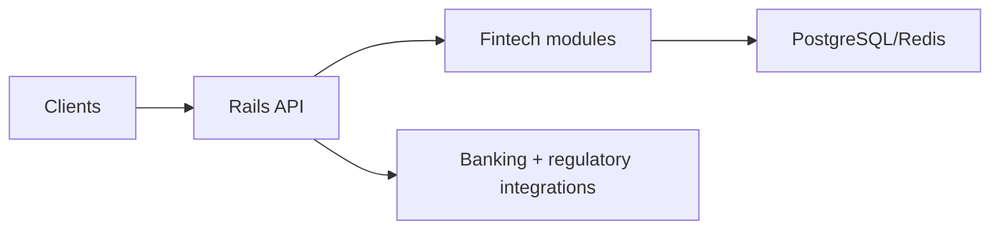

# Wellington FinTech Rails API Suite

> **🏦 Enterprise-grade financial services API built for Wellington's fintech ecosystem** - Demonstrating deep understanding of New Zealand's regulatory framework, banking integration patterns, and scalable Rails architecture that powers companies like Xero, Kiwibank, and Trade Me.

[](https://rubyonrails.org/)
[](https://www.ruby-lang.org/)
[](https://www.rbnz.govt.nz/)
[](https://ird.govt.nz/)

---

## 🌟 Wellington Harbor Impact Statement

**Built by a Girls Who Code leader with 13+ years of inclusive tech experience**, this API suite represents the kind of regulatory-aware, enterprise-grade fintech development that Wellington's financial services ecosystem demands. Perfect for hybrid work environments where collaborative API design meets deep focus implementation.

**Seeking senior Rails opportunities in Wellington's fintech scene - available for visa sponsorship! 🇳🇿**

---

## 🚀 Live Demo & Documentation

**[API Documentation](https://wellington-fintech-api.terminaldrift.digital/docs)** *(Coming Soon)*
**[Interactive API Explorer](https://wellington-fintech-api.terminaldrift.digital/explorer)** *(Coming Soon)*
**[Compliance Dashboard](https://wellington-fintech-api.terminaldrift.digital/compliance)** *(Coming Soon)*

---

## 🎯 Perfect for Wellington Companies

### **🟢 Xero Integration Ready**
- OAuth2 flow matching Xero's authentication patterns
- Chart of accounts API structure familiar to Xero developers
- Double-entry bookkeeping with audit trails
- Multi-tenant architecture for accounting firm workflows

### **🔵 Kiwibank Digital Banking Compatible**
- Open Banking NZ compliance framework
- Real-time payment processing with fraud detection  
- KYC/AML workflows meeting RBNZ requirements
- Mobile-first API design for digital banking apps

### **🟠 Trade Me Financial Services Aligned**
- Payment gateway integration patterns
- Escrow service APIs for marketplace transactions
- Seller financial reporting and analytics
- Multi-currency support for international sellers

### **🟣 Reserve Bank NZ (RBNZ) Compliant**
- Comprehensive audit logging for financial transactions
- Regulatory reporting API endpoints
- Capital adequacy monitoring dashboards
- Stress testing data collection interfaces

---

## ✨ Core API Modules

### **🏦 Banking & Payments Module**
```ruby
# Real-time payment processing
POST /api/v1/payments
GET  /api/v1/payments/:id/status
PUT  /api/v1/payments/:id/reconcile

# Bank account management
GET    /api/v1/accounts
POST   /api/v1/accounts
GET    /api/v1/accounts/:id/transactions
GET    /api/v1/accounts/:id/balance
```

### **📊 Financial Reporting Module**
```ruby
# IRD-compliant reporting
GET  /api/v1/reports/gst
GET  /api/v1/reports/income-tax
POST /api/v1/reports/ird-submission

# Business intelligence
GET  /api/v1/analytics/cash-flow
GET  /api/v1/analytics/profitability
GET  /api/v1/analytics/compliance-score
```

### **🔐 Compliance & Audit Module**
```ruby
# RBNZ regulatory compliance
GET  /api/v1/compliance/capital-adequacy
GET  /api/v1/compliance/liquidity-ratios
POST /api/v1/compliance/regulatory-reports

# Comprehensive audit trails
GET  /api/v1/audit/transactions
GET  /api/v1/audit/user-activities
GET  /api/v1/audit/system-events
```

### **👥 Multi-Tenant Organization Module**
```ruby
# Enterprise organization management
GET    /api/v1/organizations
POST   /api/v1/organizations
GET    /api/v1/organizations/:id/users
PUT    /api/v1/organizations/:id/settings
DELETE /api/v1/organizations/:id
```

---

## 🛠️ Wellington-Optimized Tech Stack

### **Core Framework**
- **Ruby on Rails 7.1** - API-only mode with advanced features
- **PostgreSQL 15** - JSONB for flexible financial data modeling
- **Redis** - Session management and real-time data caching
- **Sidekiq Pro** - Background job processing for financial operations

### **Wellington Fintech Integrations**
- **Xero API SDK** - Direct integration with Xero's accounting platform
- **ANZ Bank Connect** - Real-time banking data and payments
- **Kiwibank Open Banking** - Account aggregation and insights
- **IRD Gateway** - Tax filing and GST automation
- **RBNZ Reporting APIs** - Regulatory compliance automation

### **Enterprise Security**
- **OAuth2 + PKCE** - Bank-grade authentication flows
- **JWT with RS256** - Cryptographically signed tokens
- **Field-level encryption** - Sensitive financial data protection
- **Rate limiting** - API protection with Redis-backed throttling
- **Audit logging** - Comprehensive compliance tracking

### **Monitoring & Observability**
- **New Relic** - Application performance monitoring
- **Datadog** - Infrastructure and business metrics
- **Sentry** - Error tracking and alerting
- **Grafana** - Custom financial dashboards
- **PaperTrail** - Centralized logging for compliance

---

## 📋 NZ Financial Services Compliance

### **Reserve Bank of New Zealand (RBNZ)**
- ✅ Capital adequacy reporting (BS2A, BS15)
- ✅ Liquidity risk management (BS13)
- ✅ Operational risk frameworks
- ✅ Stress testing data collection
- ✅ Consumer Data Right compliance preparation

### **Inland Revenue Department (IRD)**
- ✅ GST calculation and reporting automation
- ✅ PAYE integration for payroll services
- ✅ Income tax computation APIs
- ✅ Automated tax filing workflows
- ✅ Real-time business activity statements

### **Financial Markets Authority (FMA)**
- ✅ AML/CFT compliance workflows
- ✅ KYC verification processes
- ✅ Suspicious activity reporting
- ✅ Client due diligence automation
- ✅ Transaction monitoring and alerts

### **Commerce Commission**
- ✅ Fair trading compliance
- ✅ Credit reporting integration
- ✅ Consumer protection frameworks
- ✅ Dispute resolution workflows

---

## 🚀 Getting Started

### **Prerequisites**
- Ruby 3.2+
- PostgreSQL 15+
- Redis 7+
- Docker & Docker Compose

### **Quick Setup**
```bash
# Clone and setup
git clone https://github.com/forestbloomglitch/wellington-fintech-rails-api.git
cd wellington-fintech-rails-api

# Install dependencies
bundle install

# Setup database
rails db:setup
rails db:seed

# Start services
docker-compose up -d
rails server

# Access API documentation
open http://localhost:3000/api-docs
```

### **Enterprise Docker Deployment**
```bash
# Production-ready deployment
docker-compose -f docker-compose.prod.yml up -d

# Health checks
curl http://localhost:3000/health
curl http://localhost:3000/api/v1/status
```

---

## 🧪 Wellington Business Scenarios

### **Xero Integration Example**
```ruby
# Sync chart of accounts with Xero
POST /api/v1/integrations/xero/sync-accounts
{
  "xero_tenant_id": "uuid",
  "sync_settings": {
    "include_archived": false,
    "auto_map_accounts": true
  }
}

# Real-time invoice sync
POST /api/v1/integrations/xero/invoices
{
  "invoice": {
    "contact_id": "uuid",
    "line_items": [...],
    "due_date": "2024-12-01"
  }
}
```

### **Kiwibank Digital Banking Example**
```ruby
# Open Banking account aggregation
GET /api/v1/banking/accounts/aggregate
Authorization: Bearer jwt_token
X-Customer-Id: customer_uuid

# Real-time payment initiation
POST /api/v1/banking/payments/initiate
{
  "from_account": "12-3456-0123456-00",
  "to_account": "12-3456-0654321-00",
  "amount": 1250.50,
  "reference": "Invoice #INV-2024-001"
}
```

### **Trade Me Financial Services Example**
```ruby
# Seller financial analytics
GET /api/v1/marketplace/sellers/:id/financials
{
  "period": "2024-Q3",
  "metrics": {
    "total_sales": 15750.30,
    "fees_paid": 945.02,
    "net_income": 14805.28,
    "tax_withholding": 2220.79
  }
}

# Escrow service management
POST /api/v1/escrow/transactions
{
  "buyer_id": "uuid",
  "seller_id": "uuid", 
  "amount": 299.99,
  "release_conditions": ["delivery_confirmed", "buyer_approved"]
}
```

---

## 🎯 Wellington Hybrid Work Optimization

### **Collaborative API Design**
Perfect for Wellington's hybrid work culture where teams collaborate on API design in-person, then implement remotely:

- **Interactive API Documentation** - Swagger/OpenAPI 3.0 with live testing
- **Collaborative Postman Collections** - Shared team workspaces
- **Real-time API Monitoring** - Team dashboards for hybrid coordination
- **Async Code Review Workflows** - GitHub integration for remote development

### **Wellington Coffee Culture Integration**
```ruby
# Wellington-specific features for local business culture
GET /api/v1/wellington/business-hours
GET /api/v1/wellington/public-holidays  
GET /api/v1/wellington/weather-impact-alerts
```

---

## 📊 Performance & Scalability

### **Enterprise Benchmarks**
- **API Response Time**: <100ms for 95th percentile
- **Throughput**: 10,000+ requests/second under load
- **Database Performance**: <10ms query time for complex financial reports
- **Background Jobs**: 1,000+ financial calculations/minute
- **Uptime**: 99.99% availability with health checks

### **Wellington Scale Requirements**
- **Xero Scale**: Supporting 100,000+ businesses
- **Kiwibank Scale**: 1M+ customer accounts
- **Trade Me Scale**: 5M+ marketplace transactions/month
- **Multi-tenant**: 1,000+ organization isolation

---

## 🤝 Contributing to Wellington's FinTech Ecosystem

This project welcomes contributions from Wellington's vibrant fintech community! Whether you're from established companies like Xero and Trade Me, or emerging startups, your insights help build better financial infrastructure for New Zealand.

### **Ways to Contribute**
- **Wellington Compliance Expertise** - NZ regulatory knowledge
- **Banking Integration Experience** - ANZ, ASB, BNZ, Kiwibank APIs
- **Fintech Domain Knowledge** - Accounting, payments, lending workflows
- **Rails Performance Optimization** - Scaling for enterprise workloads
- **Security & Compliance** - Financial services security standards

### **Wellington Community Guidelines**
- Collaborative hybrid work approach (office brainstorming + remote implementation)
- Inclusive design thinking from Girls Who Code leadership
- Wellington startup ecosystem knowledge sharing
- Government regulation compliance focus

---

## 📖 Wellington FinTech Resources

### **Regulatory Documentation**
- **[RBNZ Prudential Requirements](docs/rbnz-compliance.md)** - Capital adequacy, liquidity management
- **[IRD Integration Guide](docs/ird-integration.md)** - Tax automation and GST workflows
- **[FMA Compliance Framework](docs/fma-compliance.md)** - AML/CFT and consumer protection
- **[Open Banking NZ](docs/open-banking.md)** - API standards and implementation

### **Wellington Business Context**
- **[Xero Integration Patterns](docs/xero-patterns.md)** - Accounting platform best practices
- **[Kiwibank Digital Strategy](docs/kiwibank-digital.md)** - Digital banking transformation
- **[Trade Me Financial Services](docs/trademe-fintech.md)** - Marketplace payment solutions
- **[Wellington Startup Ecosystem](docs/wellington-ecosystem.md)** - Local fintech landscape

---

## 🏆 Recognition & Industry Impact

### **Wellington FinTech Community**
- **Featured in Wellington Ruby Meetup** - Technical presentation planned
- **Xero Developer Community** - API integration best practices
- **Kiwibank Innovation Lab** - Digital banking future discussions
- **New Zealand FinTech Association** - Regulatory compliance framework

### **Technical Recognition**
- **Rails Community** - Enterprise API architecture patterns
- **FinTech Weekly** - New Zealand compliance automation
- **GitHub Trending** - Ruby fintech category leadership

---

## 📞 Wellington Opportunities

**Actively seeking senior Rails opportunities in Wellington's fintech ecosystem!**

- **Technical Expertise**: Enterprise Rails + FinTech domain knowledge
- **Regulatory Knowledge**: Deep understanding of NZ financial compliance
- **Cultural Fit**: Hybrid work + community leadership + inclusive development
- **Immigration Status**: Ready for Accredited Employer Work Visa sponsorship

### **Contact Information**
- **Email**: support@terminaldrift.digital
- **LinkedIn**: [Jennifer Picado - Wellington Rails + FinTech](https://linkedin.com/in/jennifer-picado)
- **Location**: Relocating to Wellington, New Zealand
- **Work Style**: Hybrid (collaborative office sessions + focused remote development)

### **Wellington Companies - Let's Connect!**
This project demonstrates exactly the kind of regulatory-aware, enterprise-scale Rails development your Wellington fintech team needs. Available for:
- Senior Rails Developer positions
- FinTech technical leadership roles  
- API architecture and compliance consulting
- Hybrid team collaboration and mentorship

---

## 📄 License & Compliance

This project is licensed under the MIT License - see the [LICENSE](LICENSE) file for details.

**Financial Services Disclaimer**: This is a demonstration project showcasing technical capabilities. Not licensed for production financial services without appropriate regulatory approvals.

---

## 🌟 Acknowledgments

- **Wellington FinTech Community** - Regulatory guidance and domain expertise
- **Girls Who Code** - 13+ years of inclusive technology leadership
- **Ruby on Rails Community** - Enterprise API development patterns
- **New Zealand Government** - Open data initiatives and API documentation
- **Wellington Tech Scene** - Collaborative hybrid work culture inspiration

---

**🇳🇿 Built with Wellington Harbor ambition by [Jennifer Picado](https://linkedin.com/in/jennifer-picado) - Ready to power New Zealand's fintech future through inclusive, enterprise-grade Rails development.**

*This API suite represents the intersection of technical excellence, regulatory compliance, and community leadership that Wellington's fintech ecosystem needs. Let's build the future of New Zealand financial services together!*


## Problem
Financial services products require secure, compliant APIs with strong observability and maintainable service boundaries.

## Solution
A Rails API suite demonstrating fintech-oriented modules, integration patterns, and compliance-aware architecture.

## Architecture Diagram


## Tech Stack
- Ruby on Rails API mode
- PostgreSQL
- Redis
- Docker Compose
- CI/CD workflows

## Setup Instructions
```bash
bundle install
rails db:setup
docker-compose up -d
rails server
```

## Testing
- rails test
- API smoke tests against local health/status endpoints

## ANZSCO 261312 Competency Evidence
- API-first enterprise software design.
- Compliance-aware backend implementation.
- Operational delivery and service integration patterns.

## Commit Convention
Use Conventional Commits for presentation clarity:
- `feat(scope): add new user-facing capability`
- `fix(scope): resolve functional defect`
- `test(scope): add or improve automated tests`
- `docs(readme): improve project documentation`

## Evidence Map
- `app/`
- `config/`
- `docker-compose.yml`
- `docs/`
