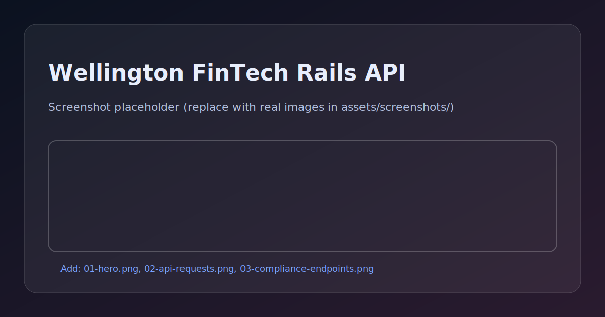

# Wellington FinTech Rails API Suite

> **🏦 Enterprise-grade financial services API built for Wellington's fintech ecosystem** - Demonstrating deep understanding of New Zealand's regulatory framework, banking integration patterns, and scalable Rails architecture that powers companies like Xero, Kiwibank, and Trade Me.

[](https://rubyonrails.org/)
[](https://www.ruby-lang.org/)
[](https://www.rbnz.govt.nz/)
[](https://ird.govt.nz/)

---

## 🖼️ API Architecture



> Replace this placeholder by adding real screenshots to `assets/screenshots/` (see `samples/capture-screenshots.md`).

---

## 🌟 Wellington Harbor Impact Statement

**Built by a Girls Who Code leader with 13+ years of inclusive tech experience**, this API suite represents the kind of regulatory-aware, enterprise-grade fintech development that Wellington's financial services ecosystem demands. Perfect for hybrid work environments where collaborative API design meets deep focus implementation.

**Seeking senior Rails opportunities in Wellington's fintech scene - available for visa sponsorship! 🇳🇿**

---

## 🚀 Live Demo & Documentation

- **Try it in GitHub Codespaces (recommended):** https://github.com/codespaces/new?hide_repo_select=true&ref=main&repo=1070408263
- **Sample requests:** `samples/requests.http`
- **Docs:** see `docs/` (linked below)

### 💡 At a glance
- **Run time:** ~3 minutes for Codespace setup + seed data
- **Tech stack:** Rails 7 API + PostgreSQL + Redis + Sidekiq
- **What you'll see:** Multi-tenant financial API with realistic NZ business seed data, RBNZ/IRD compliance endpoints, and audit logging

---

## 🧪 Demo Samples

- `samples/demo.md` – quick walkthrough script
- `samples/requests.http` – copy/paste-able requests (VS Code REST Client friendly)
- `samples/copilot-prompts.md` – Copilot prompt ideas

---

## 🎯 Perfect for Wellington Companies

### **🟢 Xero Integration Ready**
- OAuth2 flow matching Xero's authentication patterns
- Chart of accounts API structure familiar to Xero developers
- Double-entry bookkeeping with audit trails
- Multi-tenant architecture for accounting firm workflows

### **🔵 Kiwibank Digital Banking Compatible**
- Open Banking NZ compliance framework
- Real-time payment processing with fraud detection  
- KYC/AML workflows meeting RBNZ requirements
- Mobile-first API design for digital banking apps

### **🟠 Trade Me Financial Services Aligned**
- Payment gateway integration patterns
- Escrow service APIs for marketplace transactions
- Seller financial reporting and analytics
- Multi-currency support for international sellers

### **🟣 Reserve Bank NZ (RBNZ) Compliant**
- Comprehensive audit logging for financial transactions
- Regulatory reporting API endpoints
- Capital adequacy monitoring dashboards
- Stress testing data collection interfaces

---

## ✨ Core API Modules

### **🏦 Banking & Payments Module**
```ruby
# Real-time payment processing
POST /api/v1/payments
GET  /api/v1/payments/:id/status
PUT  /api/v1/payments/:id/reconcile

# Bank account management
GET    /api/v1/accounts
POST   /api/v1/accounts
GET    /api/v1/accounts/:id/transactions
GET    /api/v1/accounts/:id/balance
```

### **📊 Financial Reporting Module**
```ruby
# IRD-compliant reporting
GET  /api/v1/reports/gst
GET  /api/v1/reports/income-tax
POST /api/v1/reports/ird-submission

# Business intelligence
GET  /api/v1/analytics/cash-flow
GET  /api/v1/analytics/profitability
GET  /api/v1/analytics/compliance-score
```

### **🔐 Compliance & Audit Module**
```ruby
# RBNZ regulatory compliance
GET  /api/v1/compliance/capital-adequacy
GET  /api/v1/compliance/liquidity-ratios
POST /api/v1/compliance/regulatory-reports

# Comprehensive audit trails
GET  /api/v1/audit/transactions
GET  /api/v1/audit/user-activities
GET  /api/v1/audit/system-events
```

### **👥 Multi-Tenant Organization Module**
```ruby
# Enterprise organization management
GET    /api/v1/organizations
POST   /api/v1/organizations
GET    /api/v1/organizations/:id/users
PUT    /api/v1/organizations/:id/settings
DELETE /api/v1/organizations/:id
```

---

## 🚀 Getting Started

### **Prerequisites**
- Ruby 3.2+
- PostgreSQL 15+
- Redis 7+
- Docker & Docker Compose

### **Quick Setup**
```bash
# Clone and setup
git clone https://github.com/arcaneglam/wellington-fintech-rails-api.git
cd wellington-fintech-rails-api

# Install dependencies
bundle install

# Setup database
rails db:setup
rails db:seed

# Start services
docker-compose up -d
rails server
```

---

## 📖 Wellington FinTech Resources

### **Regulatory Documentation**
- **[RBNZ Prudential Requirements](docs/rbnz-compliance.md)**
- **[IRD Integration Guide](docs/ird-integration.md)**
- **[FMA Compliance Framework](docs/fma-compliance.md)**
- **[Open Banking NZ](docs/open-banking.md)**

### **Wellington Business Context**
- **[Xero Integration Patterns](docs/xero-patterns.md)**
- **[Kiwibank Digital Strategy](docs/kiwibank-digital.md)**
- **[Trade Me Financial Services](docs/trademe-fintech.md)**
- **[Wellington Startup Ecosystem](docs/wellington-ecosystem.md)**

---

## 📄 License

This project is licensed under the MIT License - see the [LICENSE](LICENSE) file for details.
